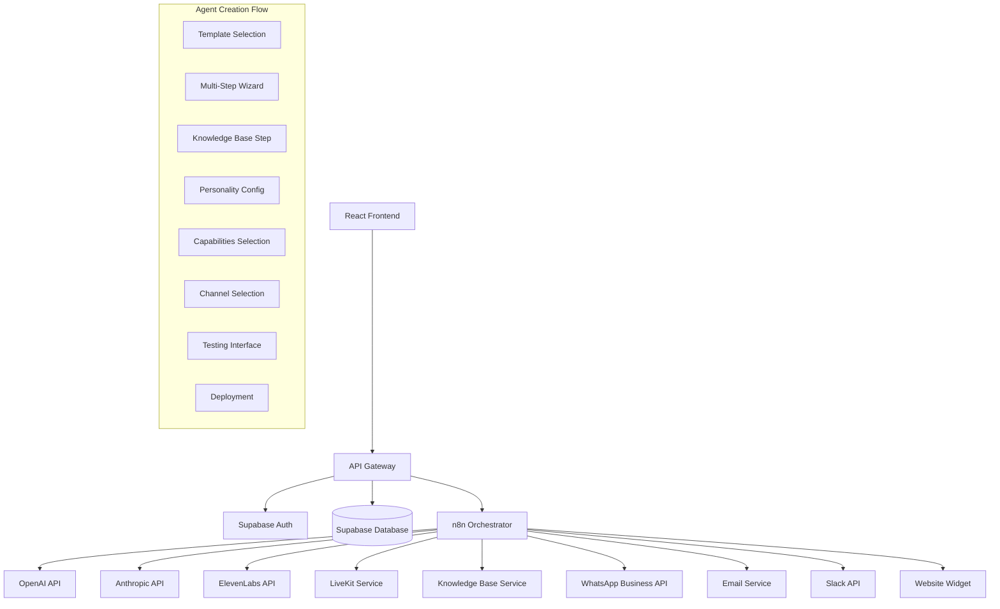

# Comprehensive AI Agent Management System - Design Document

## Overview

This design document outlines the architecture for a comprehensive AI agent management system that enables users to create, customize, and deploy intelligent agents across multiple channels. The system uses n8n as the orchestration engine and integrates with various AI services for multimodal capabilities.

## Architecture

### High-Level Architecture



### Component Architecture

#### 1. Agent Template System

```typescript
interface AgentTemplate {
  id: string;
  name: string;
  description: string;
  category: string;
  capabilities: AgentCapability[];
  defaultPersonality: PersonalityConfig;
  sampleConversations: Conversation[];
  rating: number;
  usageCount: number;
  featured: boolean;
  previewImage?: string;
}

interface AgentCapability {
  type: 'text' | 'voice' | 'image' | 'video' | 'multimodal';
  enabled: boolean;
  tools: string[];
}
```

#### 2. Multi-Step Wizard State Management

```typescript
interface AgentCreationState {
  currentStep: number;
  totalSteps: number;
  progress: number;
  template?: AgentTemplate;
  knowledgeBases: string[];
  personality: PersonalityConfig;
  capabilities: AgentCapability[];
  channels: DeploymentChannel[];
  isDraft: boolean;
  lastSaved: Date;
}

interface WizardStep {
  id: string;
  title: string;
  description: string;
  component: React.ComponentType;
  isComplete: boolean;
  isValid: boolean;
  data: any;
}
```

#### 3. Knowledge Base Integration

```typescript
interface KnowledgeBaseUpload {
  files: File[];
  uploadProgress: Map<string, number>;
  processingStatus: Map<string, ProcessingStatus>;
  supportedTypes: FileType[];
}

interface FileType {
  extension: string;
  mimeType: string;
  icon: string;
  processor: 'text' | 'image' | 'document' | 'spreadsheet';
}

interface ProcessingStatus {
  status: 'uploading' | 'processing' | 'indexing' | 'complete' | 'error';
  progress: number;
  chunks?: number;
  error?: string;
}
```

#### 4. Personality Configuration

```typescript
interface PersonalityConfig {
  name: string;
  description: string;
  tone: 'professional' | 'friendly' | 'casual' | 'formal' | 'enthusiastic';
  creativityLevel: number; // 0-100
  systemPrompt: string;
  responseStyle: ResponseStyle;
  customInstructions?: string;
}

interface ResponseStyle {
  length: 'concise' | 'detailed' | 'comprehensive';
  formality: 'casual' | 'professional' | 'formal';
  empathy: 'low' | 'medium' | 'high';
  proactivity: 'reactive' | 'balanced' | 'proactive';
}
```

#### 5. Capabilities and Tools

```typescript
interface CapabilityConfig {
  text: {
    enabled: boolean;
    provider: 'openai' | 'anthropic';
    model: string;
    tools: TextTool[];
  };
  voice: {
    enabled: boolean;
    provider: 'elevenlabs';
    voiceId: string;
    tools: VoiceTool[];
  };
  image: {
    enabled: boolean;
    provider: 'openai' | 'anthropic';
    tools: ImageTool[];
  };
  video: {
    enabled: boolean;
    provider: 'livekit';
    tools: VideoTool[];
  };
}

interface Tool {
  id: string;
  name: string;
  description: string;
  enabled: boolean;
  config: Record<string, any>;
}
```

#### 6. Deployment Channels

```typescript
interface DeploymentChannel {
  type: 'webchat' | 'whatsapp' | 'email' | 'slack';
  enabled: boolean;
  config: ChannelConfig;
  status: 'pending' | 'active' | 'error';
}

interface WebChatConfig {
  widgetColor: string;
  position: 'bottom-right' | 'bottom-left';
  welcomeMessage: string;
  allowedDomains: string[];
}

interface WhatsAppConfig {
  phoneNumberId: string;
  accessToken: string;
  webhookUrl: string;
  verifyToken: string;
}
```

## Components and Interfaces

### 1. Agent Templates Page

```typescript
// client/pages/dashboard/Agents.tsx
export default function AgentsPage() {
  const [activeTab, setActiveTab] = useState<'templates' | 'my-agents'>('templates');
  const [templates, setTemplates] = useState<AgentTemplate[]>([]);
  const [filters, setFilters] = useState<TemplateFilters>({});
  const [selectedTemplate, setSelectedTemplate] = useState<AgentTemplate | null>(null);
  
  return (
    <div className="space-y-6">
      <AgentPageHeader />
      <AgentTabs activeTab={activeTab} onTabChange={setActiveTab} />
      
      {activeTab === 'templates' && (
        <>
          <TemplateFilters filters={filters} onFiltersChange={setFilters} />
          <TemplateGrid 
            templates={templates} 
            onPreview={setSelectedTemplate}
            onUseTemplate={startAgentCreation}
          />
        </>
      )}
      
      {activeTab === 'my-agents' && (
        <MyAgentsList />
      )}
      
      {selectedTemplate && (
        <TemplatePreviewModal 
          template={selectedTemplate}
          onClose={() => setSelectedTemplate(null)}
          onUseTemplate={startAgentCreation}
        />
      )}
    </div>
  );
}
```

### 2. Agent Creation Wizard

```typescript
// client/components/agent-creation/AgentCreationWizard.tsx
export default function AgentCreationWizard({ template }: { template?: AgentTemplate }) {
  const [state, setState] = useState<AgentCreationState>(initialState);
  const [currentStep, setCurrentStep] = useState(0);
  
  const steps: WizardStep[] = [
    { id: 'template', title: 'Template Selection', component: TemplateSelectionStep },
    { id: 'knowledge', title: 'Knowledge Base', component: KnowledgeBaseStep },
    { id: 'personality', title: 'Personality', component: PersonalityStep },
    { id: 'capabilities', title: 'Capabilities', component: CapabilitiesStep },
    { id: 'channels', title: 'Channels', component: ChannelsStep },
    { id: 'testing', title: 'Testing', component: TestingStep },
    { id: 'deployment', title: 'Deployment', component: DeploymentStep },
  ];
  
  return (
    <div className="max-w-4xl mx-auto">
      <WizardHeader 
        currentStep={currentStep} 
        totalSteps={steps.length}
        progress={state.progress}
      />
      
      <WizardProgress steps={steps} currentStep={currentStep} />
      
      <div className="mt-8">
        {React.createElement(steps[currentStep].component, {
          state,
          onStateChange: setState,
          onNext: () => setCurrentStep(prev => Math.min(prev + 1, steps.length - 1)),
          onPrevious: () => setCurrentStep(prev => Math.max(prev - 1, 0)),
        })}
      </div>
    </div>
  );
}
```

### 3. Knowledge Base Step Component

```typescript
// client/components/agent-creation/steps/KnowledgeBaseStep.tsx
export default function KnowledgeBaseStep({ state, onStateChange, onNext, onPrevious }: StepProps) {
  const [existingBases, setExistingBases] = useState<KnowledgeBase[]>([]);
  const [selectedBases, setSelectedBases] = useState<string[]>([]);
  const [uploadState, setUploadState] = useState<KnowledgeBaseUpload>({
    files: [],
    uploadProgress: new Map(),
    processingStatus: new Map(),
    supportedTypes: SUPPORTED_FILE_TYPES,
  });
  
  const { getRootProps, getInputProps, isDragActive } = useDropzone({
    accept: {
      'application/pdf': ['.pdf'],
      'application/vnd.openxmlformats-officedocument.wordprocessingml.document': ['.docx'],
      'application/vnd.ms-excel': ['.xlsx'],
      'image/jpeg': ['.jpg', '.jpeg'],
      'image/png': ['.png'],
      'text/plain': ['.txt'],
    },
    onDrop: handleFileUpload,
  });
  
  return (
    <div className="space-y-6">
      <StepHeader 
        title="Knowledge Base"
        description="Add your content sources"
      />
      
      <ExistingKnowledgeBases 
        bases={existingBases}
        selected={selectedBases}
        onSelectionChange={setSelectedBases}
      />
      
      <div className="border-t pt-6">
        <h3 className="text-lg font-medium mb-4">Create New Knowledge Base</h3>
        
        <div 
          {...getRootProps()} 
          className={`border-2 border-dashed rounded-lg p-8 text-center transition-colors ${
            isDragActive ? 'border-primary bg-primary/5' : 'border-gray-300'
          }`}
        >
          <input {...getInputProps()} />
          <FileUploadInterface 
            isDragActive={isDragActive}
            supportedTypes={uploadState.supportedTypes}
          />
        </div>
        
        {uploadState.files.length > 0 && (
          <FileUploadProgress 
            files={uploadState.files}
            progress={uploadState.uploadProgress}
            status={uploadState.processingStatus}
          />
        )}
      </div>
      
      <StepNavigation 
        onPrevious={onPrevious}
        onNext={onNext}
        nextDisabled={selectedBases.length === 0 && uploadState.files.length === 0}
      />
    </div>
  );
}
```

### 4. n8n Integration Service

```typescript
// client/lib/n8n-service.ts
export class N8NAgentService {
  private baseUrl: string;
  private apiKey: string;
  
  constructor() {
    this.baseUrl = process.env.VITE_N8N_API_URL!;
    this.apiKey = process.env.VITE_N8N_API_KEY!;
  }
  
  async createAgentWorkflow(agent: AgentConfig): Promise<string> {
    const workflow = this.generateWorkflowDefinition(agent);
    
    const response = await fetch(`${this.baseUrl}/workflows`, {
      method: 'POST',
      headers: {
        'Authorization': `Bearer ${this.apiKey}`,
        'Content-Type': 'application/json',
      },
      body: JSON.stringify(workflow),
    });
    
    const result = await response.json();
    return result.id;
  }
  
  private generateWorkflowDefinition(agent: AgentConfig): N8NWorkflow {
    const nodes: N8NNode[] = [];
    
    // Add trigger nodes for each channel
    agent.channels.forEach(channel => {
      nodes.push(this.createChannelTrigger(channel));
    });
    
    // Add processing nodes based on capabilities
    if (agent.capabilities.text.enabled) {
      nodes.push(this.createTextProcessingNode(agent));
    }
    
    if (agent.capabilities.voice.enabled) {
      nodes.push(this.createVoiceProcessingNode(agent));
    }
    
    if (agent.capabilities.image.enabled) {
      nodes.push(this.createImageProcessingNode(agent));
    }
    
    // Add knowledge base retrieval node
    if (agent.knowledgeBases.length > 0) {
      nodes.push(this.createKnowledgeRetrievalNode(agent));
    }
    
    // Add response generation node
    nodes.push(this.createResponseGenerationNode(agent));
    
    return {
      name: `Agent: ${agent.name}`,
      nodes,
      connections: this.generateConnections(nodes),
      active: true,
    };
  }
}
```

## Data Models

### Database Schema

```sql
-- Agent Templates
CREATE TABLE agent_templates (
  id UUID PRIMARY KEY DEFAULT gen_random_uuid(),
  name TEXT NOT NULL,
  description TEXT,
  category TEXT,
  capabilities JSONB,
  default_personality JSONB,
  sample_conversations JSONB,
  rating DECIMAL(2,1),
  usage_count INTEGER DEFAULT 0,
  featured BOOLEAN DEFAULT false,
  created_at TIMESTAMP WITH TIME ZONE DEFAULT NOW(),
  updated_at TIMESTAMP WITH TIME ZONE DEFAULT NOW()
);

-- User Agents
CREATE TABLE user_agents (
  id UUID PRIMARY KEY DEFAULT gen_random_uuid(),
  user_id UUID REFERENCES auth.users(id) ON DELETE CASCADE,
  template_id UUID REFERENCES agent_templates(id),
  name TEXT NOT NULL,
  description TEXT,
  personality_config JSONB,
  capabilities_config JSONB,
  knowledge_bases TEXT[],
  deployment_channels JSONB,
  n8n_workflow_id TEXT,
  status TEXT CHECK (status IN ('draft', 'testing', 'active', 'paused', 'error')),
  created_at TIMESTAMP WITH TIME ZONE DEFAULT NOW(),
  updated_at TIMESTAMP WITH TIME ZONE DEFAULT NOW()
);

-- Agent Conversations
CREATE TABLE agent_conversations (
  id UUID PRIMARY KEY DEFAULT gen_random_uuid(),
  agent_id UUID REFERENCES user_agents(id) ON DELETE CASCADE,
  channel_type TEXT,
  channel_id TEXT,
  messages JSONB,
  metadata JSONB,
  created_at TIMESTAMP WITH TIME ZONE DEFAULT NOW(),
  updated_at TIMESTAMP WITH TIME ZONE DEFAULT NOW()
);

-- Agent Analytics
CREATE TABLE agent_analytics (
  id UUID PRIMARY KEY DEFAULT gen_random_uuid(),
  agent_id UUID REFERENCES user_agents(id) ON DELETE CASCADE,
  date DATE,
  conversations_count INTEGER DEFAULT 0,
  messages_count INTEGER DEFAULT 0,
  response_time_avg DECIMAL,
  satisfaction_score DECIMAL(2,1),
  channel_breakdown JSONB,
  created_at TIMESTAMP WITH TIME ZONE DEFAULT NOW()
);
```

## Error Handling

### Agent Creation Errors
- Template loading failures
- Knowledge base upload errors
- File processing failures
- n8n workflow creation errors
- Deployment configuration errors

### Runtime Errors
- API service failures
- Knowledge base retrieval errors
- Multimodal processing errors
- Channel delivery failures

## Testing Strategy

### Unit Tests
- Agent template management
- Wizard state management
- File upload and processing
- n8n workflow generation
- Multimodal input handling

### Integration Tests
- End-to-end agent creation flow
- Knowledge base integration
- n8n workflow execution
- Channel deployment testing
- Multimodal conversation flows

### User Acceptance Tests
- Template selection and preview
- Complete agent creation workflow
- Agent testing and deployment
- Cross-channel functionality
- Performance and scalability

## Security Considerations

- Secure file upload and processing
- API key management for external services
- User data isolation
- n8n workflow security
- Channel authentication and authorization
- Content filtering and moderation

## Performance Considerations

- Lazy loading of templates and agents
- Efficient file upload with chunking
- Real-time progress updates
- Caching of frequently accessed data
- Optimized knowledge base retrieval
- Scalable n8n workflow execution