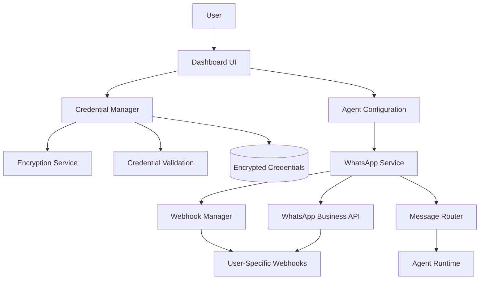

# User-Provided WhatsApp Credentials Design

## Overview

This design refactors the WhatsApp Business API integration from a platform-centric model to a user-centric model where users provide their own WhatsApp Business API credentials. This approach improves security, scalability, and user control while eliminating the need for platform-level WhatsApp credentials.

## Architecture

### High-Level Architecture



### Component Architecture

1. **Credential Management Layer**
   - Secure storage and encryption of user credentials
   - Credential validation and health monitoring
   - Migration utilities for existing integrations

2. **Dynamic Webhook Layer**
   - User-specific webhook URL generation
   - Automatic webhook configuration with WhatsApp API
   - Message routing based on webhook source

3. **Agent Integration Layer**
   - Per-agent WhatsApp configuration
   - Phone number selection and management
   - Integration status monitoring

## Components and Interfaces

### 1. WhatsApp Credential Manager

```typescript
interface WhatsAppCredentials {
  id: string;
  user_id: string;
  business_account_id: string;
  access_token: string; // Encrypted
  phone_number_id: string;
  phone_number: string;
  display_name: string;
  webhook_verify_token: string;
  status: 'active' | 'invalid' | 'expired' | 'suspended';
  last_validated: string;
  created_at: string;
  updated_at: string;
}

interface CredentialManager {
  // Credential CRUD operations
  storeCredentials(userId: string, credentials: WhatsAppCredentialsInput): Promise<WhatsAppCredentials>;
  getCredentials(userId: string, credentialId: string): Promise<WhatsAppCredentials | null>;
  updateCredentials(credentialId: string, updates: Partial<WhatsAppCredentialsInput>): Promise<WhatsAppCredentials>;
  deleteCredentials(credentialId: string): Promise<void>;
  
  // Validation and health
  validateCredentials(credentials: WhatsAppCredentialsInput): Promise<ValidationResult>;
  checkCredentialHealth(credentialId: string): Promise<HealthStatus>;
  
  // Encryption utilities
  encryptCredentials(credentials: WhatsAppCredentialsInput): Promise<EncryptedCredentials>;
  decryptCredentials(encrypted: EncryptedCredentials): Promise<WhatsAppCredentialsInput>;
}
```

### 2. Dynamic Webhook Manager

```typescript
interface WebhookConfiguration {
  id: string;
  user_id: string;
  credential_id: string;
  webhook_url: string;
  webhook_token: string;
  phone_number_id: string;
  status: 'active' | 'pending' | 'failed';
  created_at: string;
}

interface WebhookManager {
  // Webhook lifecycle
  generateWebhookUrl(userId: string, credentialId: string): string;
  configureWebhook(credentials: WhatsAppCredentials): Promise<WebhookConfiguration>;
  updateWebhookConfiguration(webhookId: string, config: Partial<WebhookConfiguration>): Promise<void>;
  removeWebhook(webhookId: string): Promise<void>;
  
  // Message routing
  routeIncomingMessage(webhookUrl: string, message: WhatsAppMessage): Promise<void>;
  identifyTargetAgent(phoneNumberId: string, message: WhatsAppMessage): Promise<string>;
}
```

### 3. Agent WhatsApp Integration

```typescript
interface AgentWhatsAppConfig {
  id: string;
  agent_id: string;
  credential_id: string;
  phone_number_id: string;
  enabled: boolean;
  auto_reply: boolean;
  business_hours?: {
    enabled: boolean;
    timezone: string;
    schedule: Array<{
      day: string;
      start: string;
      end: string;
    }>;
  };
  welcome_message?: string;
  fallback_message?: string;
  created_at: string;
  updated_at: string;
}

interface AgentWhatsAppService {
  // Agent configuration
  enableWhatsAppForAgent(agentId: string, config: AgentWhatsAppConfigInput): Promise<AgentWhatsAppConfig>;
  updateAgentWhatsAppConfig(configId: string, updates: Partial<AgentWhatsAppConfigInput>): Promise<AgentWhatsAppConfig>;
  disableWhatsAppForAgent(agentId: string): Promise<void>;
  
  // Message handling
  sendMessage(agentId: string, to: string, message: WhatsAppMessageContent): Promise<WhatsAppMessageResponse>;
  handleIncomingMessage(agentId: string, message: WhatsAppMessage): Promise<void>;
  
  // Status and monitoring
  getAgentWhatsAppStatus(agentId: string): Promise<WhatsAppIntegrationStatus>;
  getMessageHistory(agentId: string, customerId: string): Promise<WhatsAppMessage[]>;
}
```

### 4. Encryption Service

```typescript
interface EncryptionService {
  encrypt(data: string, userId: string): Promise<string>;
  decrypt(encryptedData: string, userId: string): Promise<string>;
  generateUserKey(userId: string): Promise<string>;
  rotateUserKey(userId: string): Promise<void>;
}
```

## Data Models

### Database Schema

```sql
-- User WhatsApp credentials (encrypted)
CREATE TABLE whatsapp_credentials (
  id UUID PRIMARY KEY DEFAULT gen_random_uuid(),
  user_id UUID REFERENCES auth.users(id) ON DELETE CASCADE,
  business_account_id TEXT NOT NULL,
  access_token_encrypted TEXT NOT NULL,
  phone_number_id TEXT NOT NULL,
  phone_number TEXT NOT NULL,
  display_name TEXT NOT NULL,
  webhook_verify_token TEXT NOT NULL,
  status TEXT DEFAULT 'active' CHECK (status IN ('active', 'invalid', 'expired', 'suspended')),
  last_validated TIMESTAMPTZ,
  created_at TIMESTAMPTZ DEFAULT NOW(),
  updated_at TIMESTAMPTZ DEFAULT NOW(),
  UNIQUE(user_id, phone_number_id)
);

-- Webhook configurations
CREATE TABLE whatsapp_webhooks (
  id UUID PRIMARY KEY DEFAULT gen_random_uuid(),
  user_id UUID REFERENCES auth.users(id) ON DELETE CASCADE,
  credential_id UUID REFERENCES whatsapp_credentials(id) ON DELETE CASCADE,
  webhook_url TEXT NOT NULL UNIQUE,
  webhook_token TEXT NOT NULL,
  phone_number_id TEXT NOT NULL,
  status TEXT DEFAULT 'pending' CHECK (status IN ('active', 'pending', 'failed')),
  created_at TIMESTAMPTZ DEFAULT NOW(),
  updated_at TIMESTAMPTZ DEFAULT NOW()
);

-- Agent WhatsApp configurations
CREATE TABLE agent_whatsapp_configs (
  id UUID PRIMARY KEY DEFAULT gen_random_uuid(),
  agent_id UUID REFERENCES agents(id) ON DELETE CASCADE,
  credential_id UUID REFERENCES whatsapp_credentials(id) ON DELETE CASCADE,
  phone_number_id TEXT NOT NULL,
  enabled BOOLEAN DEFAULT true,
  auto_reply BOOLEAN DEFAULT true,
  business_hours JSONB,
  welcome_message TEXT,
  fallback_message TEXT,
  created_at TIMESTAMPTZ DEFAULT NOW(),
  updated_at TIMESTAMPTZ DEFAULT NOW(),
  UNIQUE(agent_id)
);

-- WhatsApp message history
CREATE TABLE whatsapp_messages (
  id UUID PRIMARY KEY DEFAULT gen_random_uuid(),
  agent_id UUID REFERENCES agents(id) ON DELETE CASCADE,
  whatsapp_message_id TEXT NOT NULL,
  conversation_id UUID REFERENCES conversations(id),
  from_phone TEXT NOT NULL,
  to_phone TEXT NOT NULL,
  direction TEXT NOT NULL CHECK (direction IN ('inbound', 'outbound')),
  message_type TEXT NOT NULL,
  content JSONB NOT NULL,
  status TEXT DEFAULT 'sent',
  timestamp TIMESTAMPTZ NOT NULL,
  created_at TIMESTAMPTZ DEFAULT NOW(),
  UNIQUE(whatsapp_message_id)
);

-- Encryption keys (for user-specific encryption)
CREATE TABLE user_encryption_keys (
  user_id UUID PRIMARY KEY REFERENCES auth.users(id) ON DELETE CASCADE,
  key_hash TEXT NOT NULL,
  salt TEXT NOT NULL,
  created_at TIMESTAMPTZ DEFAULT NOW(),
  updated_at TIMESTAMPTZ DEFAULT NOW()
);
```

## Error Handling

### Error Types and Responses

1. **Credential Validation Errors**
   - Invalid access token
   - Expired credentials
   - Insufficient permissions
   - Rate limiting

2. **Webhook Configuration Errors**
   - Webhook URL conflicts
   - WhatsApp API webhook setup failures
   - Network connectivity issues

3. **Message Delivery Errors**
   - Phone number not reachable
   - Message content violations
   - API rate limits exceeded

### Error Recovery Strategies

1. **Automatic Retry Logic**
   - Exponential backoff for transient failures
   - Circuit breaker pattern for persistent failures

2. **Graceful Degradation**
   - Disable WhatsApp features when credentials are invalid
   - Fallback to email notifications when WhatsApp fails

3. **User Notification System**
   - Real-time alerts for credential issues
   - Dashboard warnings for integration problems

## Testing Strategy

### Unit Tests

1. **Credential Manager Tests**
   - Encryption/decryption functionality
   - Credential validation logic
   - CRUD operations

2. **Webhook Manager Tests**
   - URL generation uniqueness
   - Message routing accuracy
   - Configuration management

3. **Integration Service Tests**
   - Agent configuration management
   - Message sending/receiving
   - Status monitoring

### Integration Tests

1. **WhatsApp API Integration**
   - Credential validation with real API
   - Webhook configuration testing
   - Message flow end-to-end

2. **Database Integration**
   - Encrypted storage and retrieval
   - Foreign key constraints
   - Data consistency

### Security Tests

1. **Encryption Testing**
   - Key generation and rotation
   - Data encryption/decryption
   - Access control validation

2. **Webhook Security**
   - Token validation
   - Request signature verification
   - Rate limiting

## Migration Strategy

### Phase 1: Parallel System Implementation
- Implement new user credential system alongside existing platform credentials
- Add feature flags to control which system is used
- Ensure backward compatibility

### Phase 2: Migration Tools
- Create migration wizard for existing users
- Provide credential import/export functionality
- Implement rollback mechanisms

### Phase 3: Platform Credential Deprecation
- Gradually migrate existing integrations
- Remove platform credential requirements
- Clean up legacy code and configurations

## Security Considerations

### Data Protection
- User credentials encrypted at rest using AES-256
- User-specific encryption keys derived from secure key derivation functions
- Regular key rotation capabilities

### Access Control
- Credentials accessible only by the owning user
- Role-based access for admin functions
- Audit logging for all credential operations

### API Security
- Webhook signature verification
- Rate limiting per user/credential
- Input validation and sanitization

### Compliance
- GDPR compliance for credential deletion
- SOC 2 compliance for data handling
- Regular security audits and penetration testing