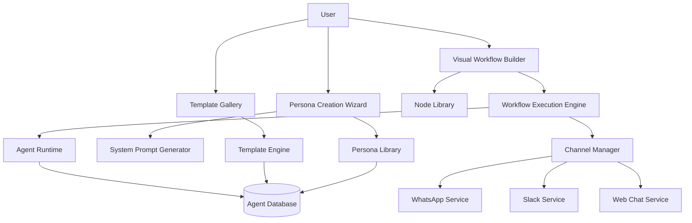

# Visual Agent Builder Design

## Overview

The Visual Agent Builder transforms the current static template system into a dynamic, no-code platform where users can create, customize, and deploy functional AI agents through visual workflows. The system combines drag-and-drop workflow building with guided persona creation and real-time testing capabilities.

## Architecture

### High-Level Architecture



### Component Architecture

1. **Visual Workflow Builder**
   - Drag-and-drop canvas with node-based workflow creation
   - Real-time validation and connection management
   - Template editing and customization capabilities

2. **Persona Creation System**
   - Multi-step guided wizard for agent personality definition
   - Dynamic prompt generation based on user choices
   - Scenario-based behavior configuration

3. **Template Management**
   - Dynamic template loading and editing
   - Custom template creation and sharing
   - Template marketplace with community contributions

4. **Agent Deployment Engine**
   - Real agent creation from visual workflows
   - Automatic API endpoint generation
   - Channel integration and webhook setup

## Components and Interfaces

### 1. Visual Workflow Builder

```typescript
interface WorkflowNode {
  id: string;
  type: 'trigger' | 'action' | 'condition' | 'integration' | 'response';
  name: string;
  description: string;
  icon: string;
  category: string;
  inputs: NodePort[];
  outputs: NodePort[];
  configuration: NodeConfiguration;
  position: { x: number; y: number };
  metadata?: Record<string, any>;
}

interface NodePort {
  id: string;
  name: string;
  type: 'data' | 'control' | 'event';
  dataType: 'string' | 'number' | 'object' | 'boolean' | 'any';
  required: boolean;
  description: string;
}

interface WorkflowConnection {
  id: string;
  sourceNodeId: string;
  sourcePortId: string;
  targetNodeId: string;
  targetPortId: string;
  metadata?: Record<string, any>;
}

interface AgentWorkflow {
  id: string;
  name: string;
  description: string;
  version: string;
  nodes: WorkflowNode[];
  connections: WorkflowConnection[];
  variables: WorkflowVariable[];
  triggers: WorkflowTrigger[];
  metadata: {
    created_at: string;
    updated_at: string;
    created_by: string;
    template_id?: string;
    is_template: boolean;
    tags: string[];
  };
}

interface WorkflowBuilder {
  // Canvas management
  loadWorkflow(workflowId: string): Promise<AgentWorkflow>;
  saveWorkflow(workflow: AgentWorkflow): Promise<void>;
  exportWorkflow(workflowId: string): Promise<string>;
  importWorkflow(workflowData: string): Promise<AgentWorkflow>;
  
  // Node management
  addNode(nodeType: string, position: { x: number; y: number }): WorkflowNode;
  removeNode(nodeId: string): void;
  updateNode(nodeId: string, updates: Partial<WorkflowNode>): void;
  duplicateNode(nodeId: string): WorkflowNode;
  
  // Connection management
  createConnection(connection: Omit<WorkflowConnection, 'id'>): WorkflowConnection;
  removeConnection(connectionId: string): void;
  validateConnection(connection: WorkflowConnection): ValidationResult;
  
  // Execution and testing
  executeWorkflow(workflow: AgentWorkflow, testData: any): Promise<ExecutionResult>;
  debugWorkflow(workflow: AgentWorkflow, breakpoints: string[]): Promise<DebugSession>;
  validateWorkflow(workflow: AgentWorkflow): ValidationResult[];
}
```

### 2. Persona Creation System

```typescript
interface PersonaDefinition {
  id: string;
  name: string;
  role: string;
  personality: {
    tone: 'professional' | 'friendly' | 'casual' | 'formal' | 'enthusiastic';
    style: 'concise' | 'detailed' | 'conversational' | 'technical';
    empathy_level: number; // 1-10
    creativity_level: number; // 1-10
    formality_level: number; // 1-10
  };
  expertise: {
    domains: string[];
    knowledge_depth: 'basic' | 'intermediate' | 'expert';
    specializations: string[];
  };
  behavior: {
    greeting_style: string;
    escalation_triggers: string[];
    response_patterns: ResponsePattern[];
    constraints: string[];
    fallback_responses: string[];
  };
  context_awareness: {
    remember_conversation: boolean;
    use_customer_history: boolean;
    adapt_to_sentiment: boolean;
    personalization_level: number; // 1-10
  };
  generated_prompt: string;
  created_at: string;
  updated_at: string;
}

interface ResponsePattern {
  scenario: string;
  trigger_keywords: string[];
  response_template: string;
  follow_up_actions: string[];
  escalation_conditions: string[];
}

interface PersonaWizard {
  // Wizard flow management
  startPersonaCreation(): PersonaCreationSession;
  getWizardStep(sessionId: string, stepId: string): WizardStep;
  submitStepData(sessionId: string, stepId: string, data: any): Promise<void>;
  generatePersona(sessionId: string): Promise<PersonaDefinition>;
  
  // Persona management
  savePersona(persona: PersonaDefinition): Promise<void>;
  loadPersona(personaId: string): Promise<PersonaDefinition>;
  clonePersona(personaId: string): Promise<PersonaDefinition>;
  
  // Prompt generation
  generateSystemPrompt(persona: PersonaDefinition): string;
  testPersonaResponse(persona: PersonaDefinition, scenario: string): Promise<string>;
  optimizePersona(persona: PersonaDefinition, feedback: PersonaFeedback[]): Promise<PersonaDefinition>;
}

interface WizardStep {
  id: string;
  title: string;
  description: string;
  type: 'single_choice' | 'multiple_choice' | 'text_input' | 'slider' | 'scenario_builder';
  options?: WizardOption[];
  validation?: ValidationRule[];
  dependencies?: StepDependency[];
}
```

### 3. Template Management System

```typescript
interface AgentTemplate {
  id: string;
  name: string;
  description: string;
  category: string;
  tags: string[];
  workflow: AgentWorkflow;
  persona: PersonaDefinition;
  channels: ChannelConfiguration[];
  integrations: IntegrationConfiguration[];
  knowledge_bases: KnowledgeBaseConfiguration[];
  metadata: {
    author: string;
    version: string;
    created_at: string;
    updated_at: string;
    usage_count: number;
    rating: number;
    is_official: boolean;
    is_public: boolean;
  };
  customization_options: CustomizationOption[];
  setup_instructions: SetupInstruction[];
}

interface TemplateManager {
  // Template CRUD
  createTemplate(template: Omit<AgentTemplate, 'id'>): Promise<AgentTemplate>;
  updateTemplate(templateId: string, updates: Partial<AgentTemplate>): Promise<AgentTemplate>;
  deleteTemplate(templateId: string): Promise<void>;
  
  // Template discovery
  searchTemplates(query: string, filters: TemplateFilter[]): Promise<AgentTemplate[]>;
  getFeaturedTemplates(): Promise<AgentTemplate[]>;
  getTemplatesByCategory(category: string): Promise<AgentTemplate[]>;
  
  // Template customization
  customizeTemplate(templateId: string, customizations: TemplateCustomization[]): Promise<AgentTemplate>;
  forkTemplate(templateId: string): Promise<AgentTemplate>;
  
  // Template marketplace
  publishTemplate(templateId: string): Promise<void>;
  rateTemplate(templateId: string, rating: number, review?: string): Promise<void>;
  reportTemplate(templateId: string, reason: string): Promise<void>;
}
```

### 4. Agent Deployment Engine

```typescript
interface AgentDeployment {
  id: string;
  agent_id: string;
  workflow_id: string;
  persona_id: string;
  channels: DeployedChannel[];
  integrations: DeployedIntegration[];
  status: 'deploying' | 'active' | 'paused' | 'error';
  endpoints: {
    webhook_url: string;
    api_endpoint: string;
    chat_widget_url: string;
  };
  metrics: {
    conversations_count: number;
    messages_count: number;
    average_response_time: number;
    satisfaction_score: number;
  };
  created_at: string;
  deployed_at?: string;
  last_active?: string;
}

interface DeploymentEngine {
  // Deployment lifecycle
  deployAgent(agentConfig: AgentConfiguration): Promise<AgentDeployment>;
  updateDeployment(deploymentId: string, updates: Partial<AgentConfiguration>): Promise<void>;
  pauseDeployment(deploymentId: string): Promise<void>;
  resumeDeployment(deploymentId: string): Promise<void>;
  terminateDeployment(deploymentId: string): Promise<void>;
  
  // Runtime management
  processMessage(deploymentId: string, message: IncomingMessage): Promise<AgentResponse>;
  executeWorkflow(deploymentId: string, workflow: AgentWorkflow, context: ExecutionContext): Promise<WorkflowResult>;
  
  // Monitoring and analytics
  getDeploymentMetrics(deploymentId: string): Promise<DeploymentMetrics>;
  getDeploymentLogs(deploymentId: string, filters: LogFilter[]): Promise<LogEntry[]>;
  getDeploymentHealth(deploymentId: string): Promise<HealthStatus>;
}
```

## Data Models

### Database Schema

```sql
-- Agent workflows
CREATE TABLE agent_workflows (
  id UUID PRIMARY KEY DEFAULT gen_random_uuid(),
  user_id UUID REFERENCES auth.users(id) ON DELETE CASCADE,
  name TEXT NOT NULL,
  description TEXT,
  version TEXT DEFAULT '1.0.0',
  workflow_data JSONB NOT NULL,
  is_template BOOLEAN DEFAULT false,
  template_id UUID REFERENCES agent_workflows(id),
  status TEXT DEFAULT 'draft' CHECK (status IN ('draft', 'active', 'archived')),
  created_at TIMESTAMPTZ DEFAULT NOW(),
  updated_at TIMESTAMPTZ DEFAULT NOW()
);

-- Agent personas
CREATE TABLE agent_personas (
  id UUID PRIMARY KEY DEFAULT gen_random_uuid(),
  user_id UUID REFERENCES auth.users(id) ON DELETE CASCADE,
  name TEXT NOT NULL,
  role TEXT NOT NULL,
  personality_config JSONB NOT NULL,
  expertise_config JSONB NOT NULL,
  behavior_config JSONB NOT NULL,
  context_config JSONB NOT NULL,
  generated_prompt TEXT NOT NULL,
  created_at TIMESTAMPTZ DEFAULT NOW(),
  updated_at TIMESTAMPTZ DEFAULT NOW()
);

-- Agent templates
CREATE TABLE agent_templates (
  id UUID PRIMARY KEY DEFAULT gen_random_uuid(),
  name TEXT NOT NULL,
  description TEXT NOT NULL,
  category TEXT NOT NULL,
  tags TEXT[] DEFAULT '{}',
  workflow_id UUID REFERENCES agent_workflows(id),
  persona_id UUID REFERENCES agent_personas(id),
  configuration JSONB NOT NULL,
  metadata JSONB NOT NULL,
  is_official BOOLEAN DEFAULT false,
  is_public BOOLEAN DEFAULT false,
  usage_count INTEGER DEFAULT 0,
  rating DECIMAL(3,2) DEFAULT 0,
  created_by UUID REFERENCES auth.users(id),
  created_at TIMESTAMPTZ DEFAULT NOW(),
  updated_at TIMESTAMPTZ DEFAULT NOW()
);

-- Agent deployments
CREATE TABLE agent_deployments (
  id UUID PRIMARY KEY DEFAULT gen_random_uuid(),
  user_id UUID REFERENCES auth.users(id) ON DELETE CASCADE,
  agent_id UUID REFERENCES agents(id) ON DELETE CASCADE,
  workflow_id UUID REFERENCES agent_workflows(id),
  persona_id UUID REFERENCES agent_personas(id),
  deployment_config JSONB NOT NULL,
  endpoints JSONB NOT NULL,
  status TEXT DEFAULT 'deploying' CHECK (status IN ('deploying', 'active', 'paused', 'error')),
  metrics JSONB DEFAULT '{}',
  created_at TIMESTAMPTZ DEFAULT NOW(),
  deployed_at TIMESTAMPTZ,
  last_active TIMESTAMPTZ
);

-- Workflow execution logs
CREATE TABLE workflow_executions (
  id UUID PRIMARY KEY DEFAULT gen_random_uuid(),
  deployment_id UUID REFERENCES agent_deployments(id) ON DELETE CASCADE,
  workflow_id UUID REFERENCES agent_workflows(id),
  execution_data JSONB NOT NULL,
  status TEXT NOT NULL CHECK (status IN ('running', 'completed', 'failed', 'timeout')),
  started_at TIMESTAMPTZ DEFAULT NOW(),
  completed_at TIMESTAMPTZ,
  execution_time_ms INTEGER,
  error_message TEXT
);

-- Template ratings and reviews
CREATE TABLE template_reviews (
  id UUID PRIMARY KEY DEFAULT gen_random_uuid(),
  template_id UUID REFERENCES agent_templates(id) ON DELETE CASCADE,
  user_id UUID REFERENCES auth.users(id) ON DELETE CASCADE,
  rating INTEGER NOT NULL CHECK (rating >= 1 AND rating <= 5),
  review TEXT,
  created_at TIMESTAMPTZ DEFAULT NOW(),
  UNIQUE(template_id, user_id)
);
```

## User Experience Flow

### Template Customization Flow

1. **Template Selection**
   - User browses template gallery
   - Filters by category, rating, features
   - Previews template capabilities and workflow

2. **Visual Workflow Editing**
   - Template loads in visual workflow builder
   - User can drag/drop nodes to modify workflow
   - Real-time validation and connection management
   - Node configuration panels for detailed setup

3. **Persona Customization**
   - Multi-step wizard for persona definition
   - Role-specific question flows
   - Scenario-based behavior configuration
   - Real-time prompt generation preview

4. **Channel Configuration**
   - Dynamic channel selection based on available integrations
   - Step-by-step setup for each channel
   - Credential integration with existing user systems
   - Test connectivity and configuration validation

5. **Testing and Validation**
   - Interactive chat interface for agent testing
   - Scenario-based testing with predefined cases
   - Workflow debugging with execution visualization
   - Performance and response quality metrics

6. **Deployment**
   - One-click deployment to selected channels
   - Automatic endpoint and webhook generation
   - Real-time deployment status and health monitoring
   - Post-deployment analytics and optimization suggestions

## Integration Points

### WhatsApp Integration
- Seamless integration with user-provided WhatsApp credentials
- Dynamic webhook configuration for each deployment
- Message routing through visual workflow execution
- Support for multimedia and interactive messages

### N8N Integration
- Visual workflow nodes map to N8N workflow components
- Automatic N8N workflow generation from visual builder
- Real-time execution monitoring and debugging
- Custom node creation for specialized business logic

### Knowledge Base Integration
- Dynamic knowledge base selection during template customization
- Automatic RAG (Retrieval Augmented Generation) setup
- Context-aware document retrieval in workflows
- Knowledge base performance optimization

This design provides a comprehensive foundation for transforming your static template system into a dynamic, user-friendly agent creation platform that actually creates functional agents.